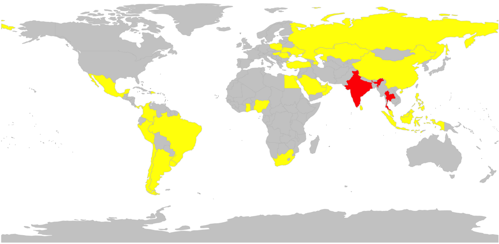
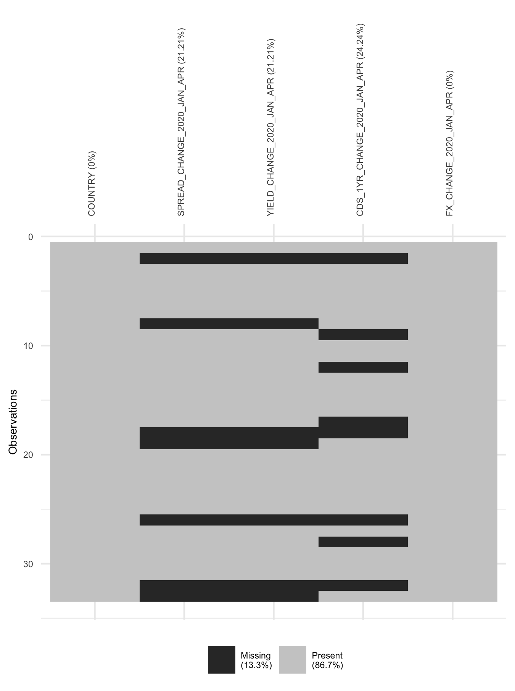
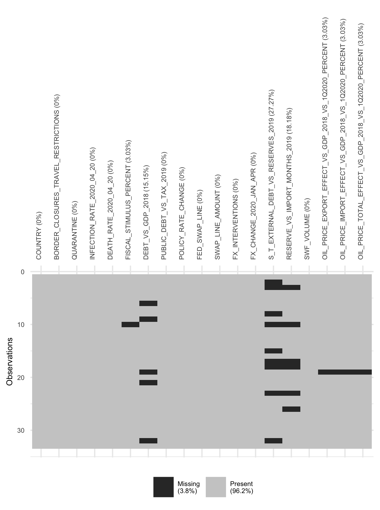

```{r setup, include=FALSE}
knitr::opts_chunk$set(echo = TRUE)
```


# Introduction

## Overview
This paper takes stock of the data gathered during the first four to six months of the year 2020. We say "four to six" because at the time of writing this document (early June), the data for June is not available yet. However, as soon as that data is available we will rerun the analysis and see if the results remain stable. In a nutshell: we explain the change in spread between 12/31/2019 - 04/30/2020 (and 12/31/2019 -  06/30/2020 as soon as the June data is out) through structural, macroeconomic, and epidemiologic variables. 

## Defining the sample of countries
In a first step, we had to choose which emerging markets we want to investigate. Since we are interested in the effect of COVID-19 on governments' ability to finance deficits in a sustainable way--that is, without increasing spreads beyond reasonable levels--we are primarily intersted in emerging markets which are "investible". As a starting point, we defined a country's "investibility" as being a constituent of the JPMorgan EMBI (Emerging Market Bond Index). This index gives investors exposure to U.S. dollar-denominated government bonds issued by emerging market countries. The index comprises more than 30 emerging market countries in a single fund. Specifically, when we looked up the constituent countries of the fund, it appears as if 31 countries are in the index as of 25 April 2020 (cf. [https://www.ishares.com/us/products/239572/ishares-jp-morgan-usd-emerging-markets-bond-etf](www.ishares.com/us/products/239572/ishares-jp-morgan-usd-emerging-markets-bond-etf) ). However, some relatively large and potentially important countries were not represented in the EMBI so that we added India and Thailand to the sample. This results in a sample of 33 countries. We call it the "EMBI+2" sample. This stands in contrast to the other project we are working on that looks at data of a 155 countries and which we call the "extended" sample. See the graph and table below for an overview of the countries in the sample.





Country | JPM EMBI constituent (1 = yes)
------------- | -------------
Content Cell  | Content Cell
Argentina  | 1
Azerbaijan  | 1
Bahrain  | 1
Brazil  | 1
Chile  | 1
China  | 1
Colombia  | 1
Dominican Republic  | 1
Egypt  | 1
Ghana  | 1
Hungary  | 1
India  | 0
Indonesia  | 1
Kazakhstan  | 1
Malaysia  | 1
Mexico  | 1
Nigeria  | 1
Oman  | 1
Panama  | 1
Peru  | 1
Philippines  | 1
Poland  | 1
Qatar  | 1
Romania  | 1
Russian Federation  | 1
Saudi Arabia  | 1
South Africa  | 1
Sri Lanka  | 1
Thailand  | 0
Turkey  | 1
Ukraine  | 1
United Arab Emirates  | 1
Uruguay  | 1
In addition, we wanted to make sure that all the countris in the sample are not only investable by being in the EMBI but that they also have a certain amount of debt outstanding. To that end, we inspected the Debt/GDP ratio of all EMBI+2 countries in the IMF's global debt database and checked if all countries have at least a ratio of 20%. This was indeed the case so that we didn't drop any of the countries out of the sample. 

The rest of this document is structured as follows: The second part outlines the data used for the analysis. The third part shows preliminary results of correlations between the variables. The fourth part shows regression results and graphical analyses. Part 5 concludes. 


# 2. Data
In the second step, we obtained data for the outcome variable(s) and the explanatory variables.

## Outcome variable(s)

* the spread of such bonds over 1-year US treasuries
* the yield of 1-year U.S. dollar-denominated bonds
* the exchange rate vis-à-vis the U.S. dollar
* CDS 
Specifically, our outcome variables are the changes of these four variables between the end of December 2019 and the end of April 2020 (June 2020). While our main outcome variable of interest is the change in spread over U.S. bonds over 4/6 months, we also look at the other variables as a robustness check. 
{ width=50% }

## Explanatory variable(s)
There are a host of explanatory variables in the dataset. Many of them are diretly sourced from the IMF World Datamapper or from the World Bank. However, due to the recency of the period of analysis and the lack of officially published data, we had to hand-code a decent chunk of the data. To do so, we looked at the IMF's country by country summary of policy responses to COVID-19 [https://www.imf.org/en/Topics/imf-and-covid19/Policy-Responses-to-COVID-19](https://www.imf.org/en/Topics/imf-and-covid19/Policy-Responses-to-COVID-19). While the following graph does not depict all explanatory variables that are in the dataset, it does show the most important ones which we also expect to be the ones that show a clearn pattern in explaning the economic fragility of emerging markets. 
{ width=50% }

## Data source
For the specific details on the variable definitions, the sources for each variable, as well as units and further information, see the sheet "codebook" in the document "data.xlsx". 


# 3. Preliminary patterns and correlations


# 4. Econometric results


# 5. Conclusion


This is an R Markdown document. Markdown is a simple formatting syntax for authoring HTML, PDF, and MS Word documents. For more details on using R Markdown see <http://rmarkdown.rstudio.com>.

When you click the **Knit** button a document will be generated that includes both content as well as the output of any embedded R code chunks within the document. You can embed an R code chunk like this:

```{r cars}
summary(cars)
```

# Including Plots

You can also embed plots, for example:

```{r pressure, echo=FALSE}
plot(pressure)
```

Note that the `echo = FALSE` parameter was added to the code chunk to prevent printing of the R code that generated the plot.
